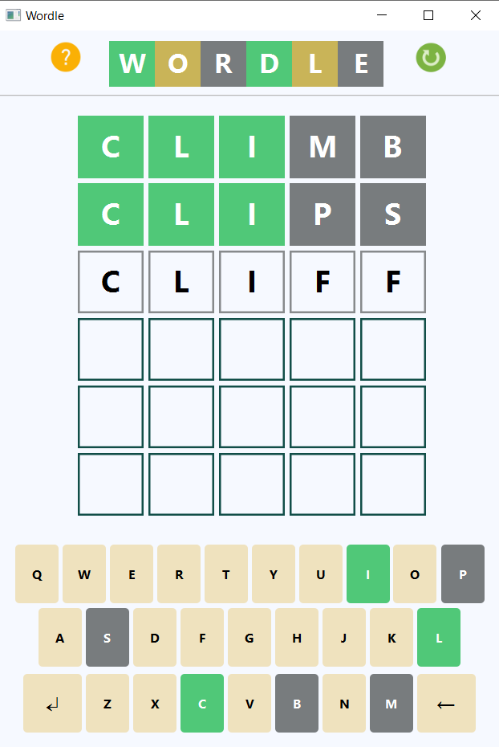
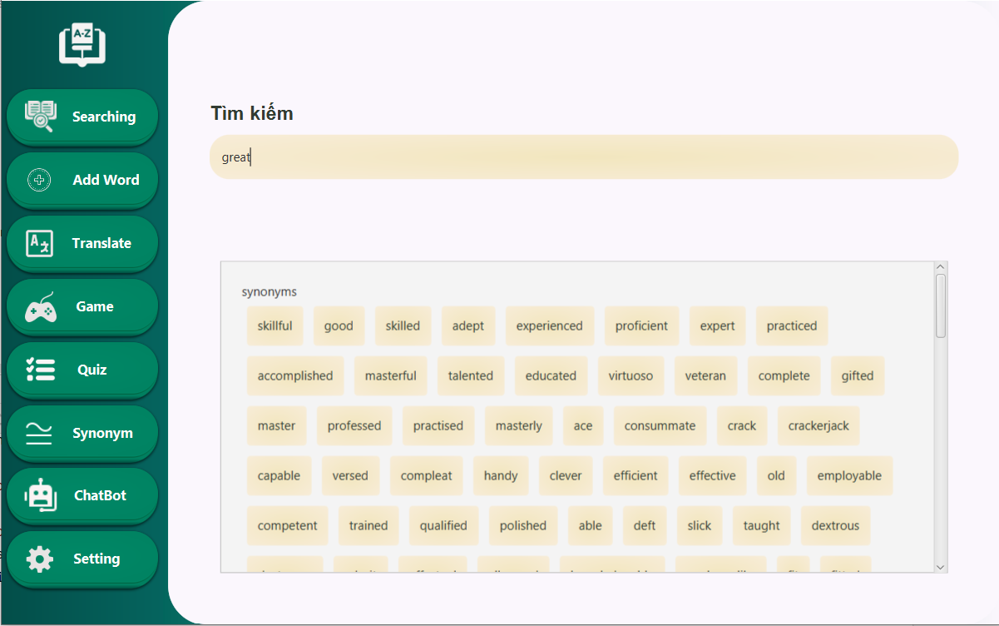

# Dictionary

## Overview
Welcome to our Dictionary Project for Object Oriented Programming course written in Java

## Table of contents

- [Authors](#authors)
- [Features](#features)
- [Setup](#setup)

## Authors

- [Phạm Công Minh](https://github.com/minh-1129) - 22028239
- [Trương Minh Phước](https://github.com/MinhPhuoc3504) - 22028024
- [Bùi Thế Công](https://github.com/buiftheescoong) - 22028193

## Features
### Search Words
You can also click the speaker icon to hear the pronunciation of the word. The rubbish bin icon will delete the word from the dictionary. You could also change the the target language from Vietnamese to English in the settings.

### Adding Words
If the word is already in the database, it will be updated. Otherwise, it will be added to the dictionary.

### Translate between 5 languages
We use APIs to translate the text, detect language and turn your speech into text.

### Quiz

### Test your listening skill
We use [Levenshtein distance](https://en.wikipedia.org/wiki/Levenshtein_distance) for scoring

### Wordle for fun
A clone of the famous game Wordle to help you memorise words while having fun


### Finding synonyms and antonyms

### Chatbot to help you learn English better
We use OpenAI API and multithreading for a real-time experience

## Setup
### Requirements
- JDK 17 or higher. 
- Maven (Apache Maven).

### Steps
- Clone this project down with git.
  ```
  git clone https://github.com/minh-1129/Dictionary_OOP
  ```
- Run with Maven.
  ```
  cd dictionary
  mvn clean javafx:run
  ```
- Or just use IntelliJ IDEA to open and run this project

